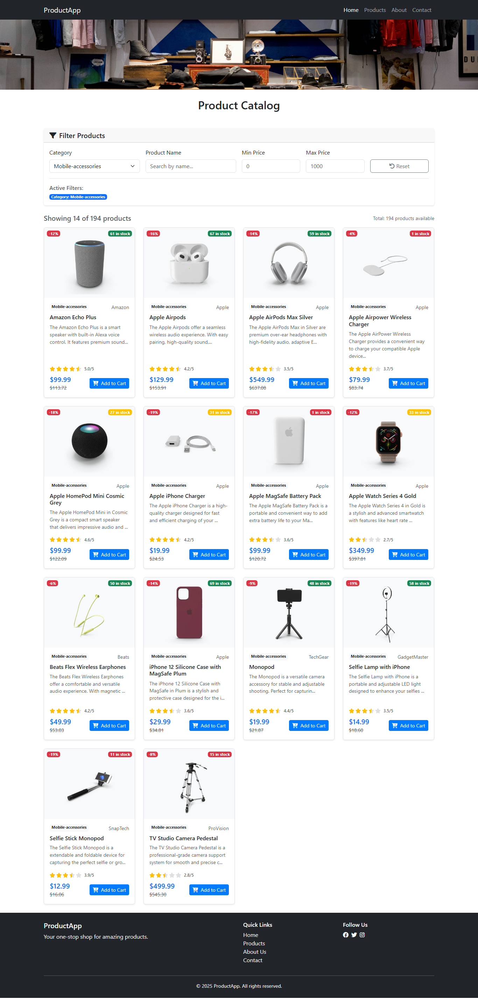

# Angular E-commerce Application

A modern e-commerce product showcase application built with Angular 20 and Bootstrap 5. This application displays a collection of products with filtering capabilities, responsive design, and a clean user interface.




##  Features

- **Product Showcase**: Display products with images, prices, stock levels, and categories
- **Responsive Design**: Mobile-first design using Bootstrap 5
- **Product Filtering**: Filter products by category, title, and price range
- **Modern UI**: Clean and intuitive user interface with Font Awesome icons
- **Stock Management**: Visual indicators for stock levels (low, medium, high)
- **Image Handling**: Fallback images for missing product images

## ️ Technologies Used

- **Frontend Framework**: Angular 20.0.0
- **Styling**: Bootstrap 5.3.0
- **Icons**: Font Awesome 6.0.0
- **Language**: TypeScript 5.8.2
- **Build Tool**: Angular CLI 20.0.0
- **Package Manager**: npm

##  Prerequisites

Before running this application, make sure you have the following installed:

- [Node.js](https://nodejs.org/) (v18 or higher)
- [npm](https://www.npmjs.com/) (comes with Node.js)
- [Angular CLI](https://angular.io/cli) (v20 or higher)

```bash
npm install -g @angular/cli
```
